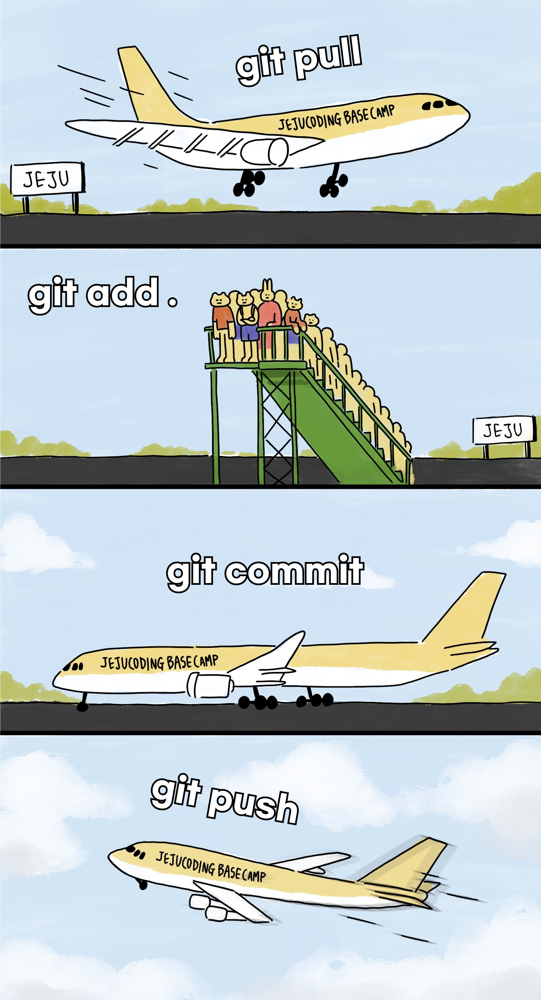

# GitHub



## **명령어**

- **git clone** + 깃헙URL + .git (띄어쓰기있음) : 처음에 파일 받아오는 것!
  - url 삽입 단축키 : ctrl + cmd + v
- **git add .** (.을 붙히는 이유 : 바뀐 파일 모두다 선택)
- **git commit -m ‘커밋메세지’** : 버젼을 만든다(기능추가될때마다 커밋함)
- **git push** : 파일을 올리는 행위

  (파일을 수정한 후 add~push까지 진행해줘야함)

- **git pull** : 받아오는거 !

( \*git clone은 리모트 설정을 자동으로 해주는 초기 다운로드에 사용하고
git pull은 **리모트 설정이 이미 되어있을 때** 업데이트 사항 등을 다운로드 할 떄 사용한다)
<br><br>
✳️  사용순서

1. **git clone 깃헙URL .git : 초기다운로드**

2. **git pull → 수정 → git add . → git commit -m ‘커밋메세지' → git push**

<br>

### 실습<br>

git clone repo주소<br>
파일 수정이나 추가<br>
git add .<br>
git commit -m 'hello1'<br>
git push<br>
<br><br>
git pull<br>
파일 수정이나 추가<br>
git add .<br>
git commit -m 'hello2'<br>
git push<br><br>

git pull<br>
파일 수정이나 추가<br>
git add .<br>
git commit -m 'hello3'<br>
git push<br><br>

✳️  GitHub을 배우는 2가지 step

1. **GUI**로 배웁니다! = 클릭하는 것
   - Graphic User Interface
   - 마우스로 클릭-클릭- 할 수 있는 환경!
   - 서버의 90% 이상은 리눅스 환경이기 때문에 GUI 환경으로 거의 할 수 없음!
2. **CLI**로 배웁니다! = 코드로 치는 것 - Command Line Interface - FE개발자들은 유저(개념) 보다는 개발자이기에 터미널과 같이 백지로 작업할 경우가 많다.
   <br><br><br>

## Git과 GitHub의 관계

<hr>

- Git → 로컬 저장소(내 컴퓨터)와 원격 저장소(서버 컴퓨터)로 나뉜다.
- 내 컴퓨터에서 작성한 프로젝트를 원격 저장소에 저장해두고, 만약 내 컴퓨터의 프로젝트가 손상되거나 다른 컴퓨터에서 코드를 가져오고 싶을 때는 언제든지 **원격 저장소에서 바로 가져올 수 있다.**
- **코드 뿐만 아니라 코드의 변경 내역까지 모두** 가져올 수 있음!
  → Git이 "버전 관리 도구"라고 불리는 이유!
  → Git은 소스코드 및 파일의 변경내역을 저장하는 분산 버전 관리 시스템
  <br><br><br>

## Git 사용하기

<hr>

### 1. 저장소 만들기

```bash
$ mkdir test // 작업할 디렉토리를 만든다
$ cd test // 해당 디렉토리로 이동하기
$ git init // 현재 디렉토리를 Git 저장소로 만든다.
```

- `git init` 을 입력하면 해당 폴더 기준으로 .git(로컬 저장소)가 생성된다.
- 로컬 저장소에는 버전정보 / 원격 저장소 주소가 저장된다.

<br>

💡 한 폴더에는 하나의 .git(로컬 저장소)을 가져야 한다. 그렇지 않을경우 충돌이 발생할 수 있다!

ex) 상위 폴더에 .git이 있는 경우, 하위폴더에서 push를 할 땐 상관 없지만 상위폴더에서 push를 하게될 때 하위폴더와 충돌하는 등의 문제가 발생할 수 있다.
따라서 하위폴더 내에 .git을 가지는게 좋다.
<br>

TIP ✨

- 원격 저장소 : push까지 완료된 내용들이 있는 저장소 (push까지 완료된 git 파일)
- 로컬 저장소 : 내가 작업하는 컴퓨터의 저장소 (내가 작업한 내용이 들어있는 git 파일)
  <br><br>

### 2. 파일을 생성하고 commit 하기!

```bash
$ touch README.md // 파일생성
$ git status // Untracked확인 (이 상태라면 add 해줘야함!)
$ git add . or git add README.md
$ git commit -m '커밋메세지'

$ git log // commit 히스토리를 조회한다
```

- Untracked 와 Tracked
  1. Untracked (관리대상이 아님) : 파일 생성 후 한번도 **$ git add** 하지 않은 상태

  2. Tracked (관리대상임) : git이 관리하는 파일임을 의미함

<br><br>

### 3. 저장소에 무시할 파일 설정하기

```bash
$ touch .gitignore
```

- push 전 .gitignore 파일에 버전관리에서 제외할 파일을 추가한다.
- 참고) .gitignore 자동생성기 활용하기
- [https://www.toptal.com/developers/gitignore](https://www.toptal.com/developers/gitignore)

<br><br><br>

### 오늘 배운 명령어 정리

```bash
$ git --version
$ git config --list
$ git init
$ ls -al
$ touch 001.html
$ git status
$ git add .
$ git commit -m 'first commit'
$ touch gitignore
```

<br><br><br>

### GitHub 토큰을 생성해준 뒤 할 일

토큰 발급이 완료되면 운영체제에 맞게 적용<br> - **Mac** <br>
push 명령어를 실행할 때 여전히 같은 에러가 나타날 수 있어, Mac 키체인에 등록되어 있는 GitHub의 권한 정보를 발급받은 **ID/Personal Access Token**으로 변경해줘야 한다.

        1) 키체인 접근 (Keychain Access app)

        2) github.com 찾기

        3) 암호보기(show password)를 클릭하여 암호를 token으로 대체


<br><br><br>

## 터미널 - 리눅스 명령어 사용해보기 (폴더 및 파일 추가 / 삭제 , 편집기 이용)

<hr>

$ mkdir youjin #디렉토리(폴더생성)

$ cd .. #상위폴더이동

$ cd test #테스트 폴더 이동

$ cd youjin #youjin 파일로 이동

$ touch test.html #test.html이라는 파일 생성

$ vi test.html #편집기 열기 #실무에서는 vim을 사용합니다

i 편집시작

ESC 편집 끝내기

:wq! 나가기

$ rm test.html. #test.html파일 영원히 삭제… 절대 복구불가

$ cat test.html

$ cd ..

$ rmdir youjin #디렉토리 완전삭제
